# Sport-Record
WHU大二下专选大作业
## 基本要求
实现一个运动记录软件。
App 包括用户管理，运动记录，运动数据统计三类功能。
# 基本架构
### 页面流程图
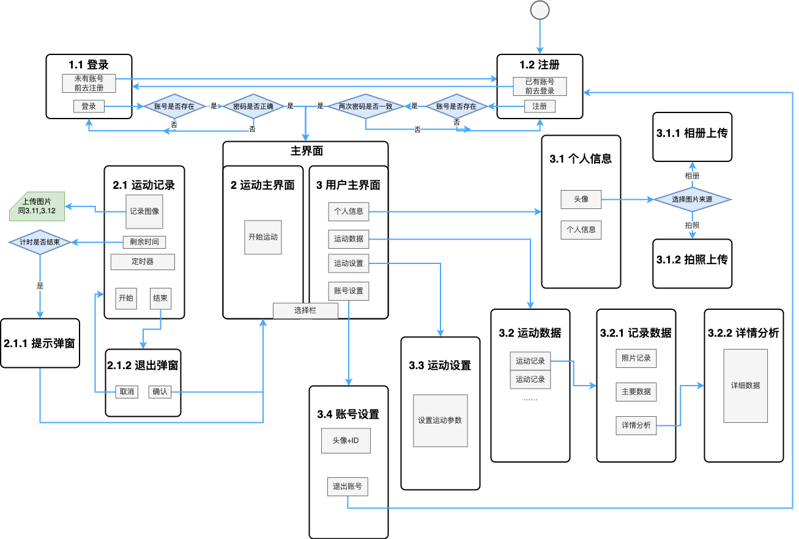
### 代码结构图
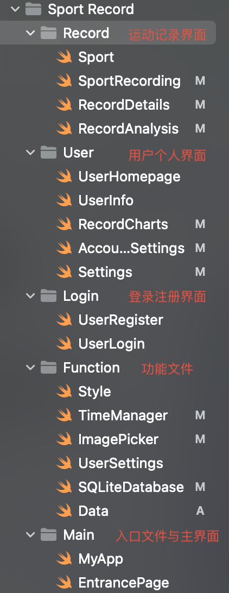
# 界面示例
## 登录与注册
### 登录
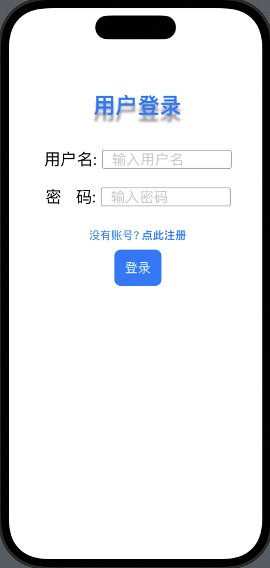
### 注册
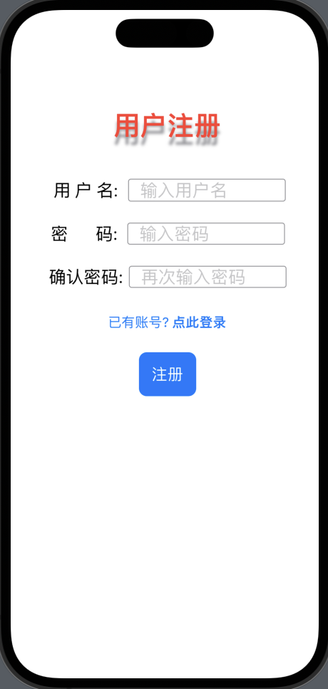

## 用户
### 用户主界面
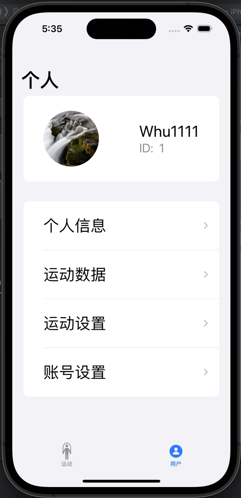
### 个人信息
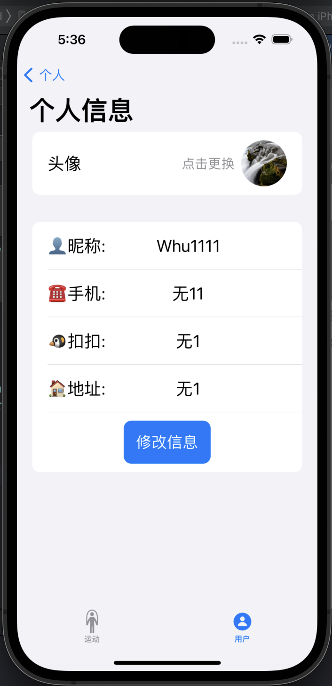
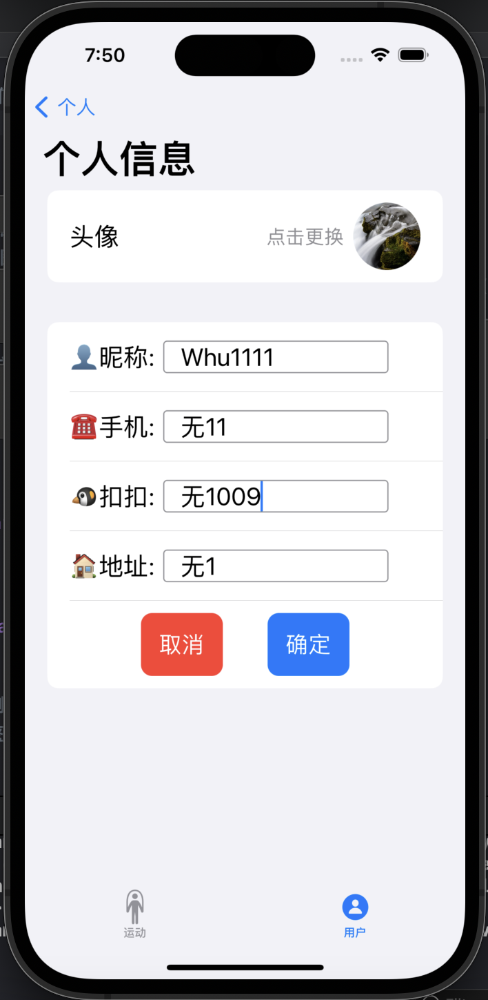
### 修改头像
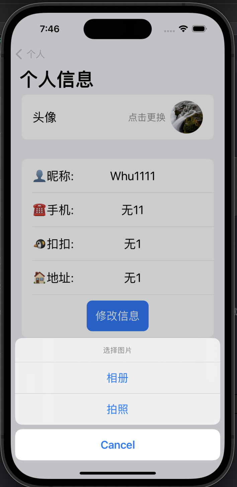

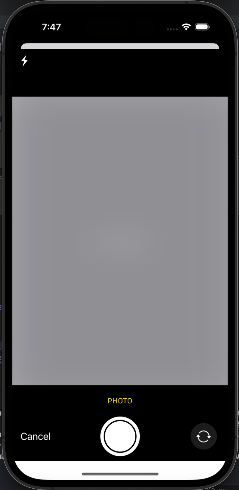
### 运动数据
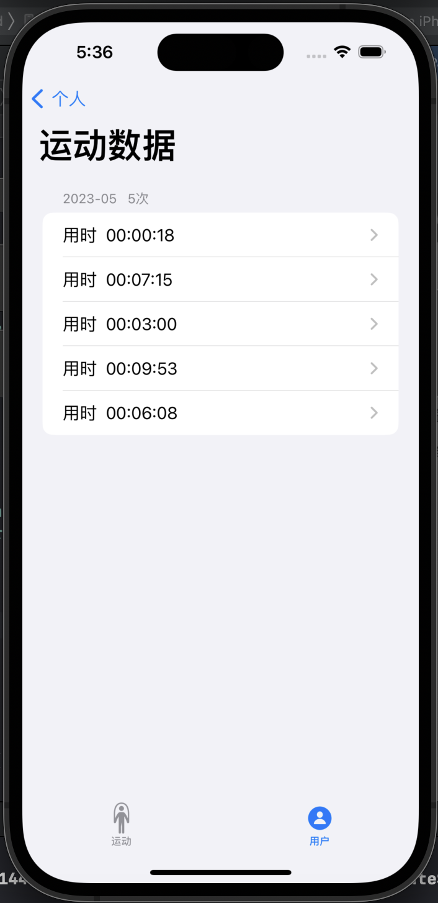
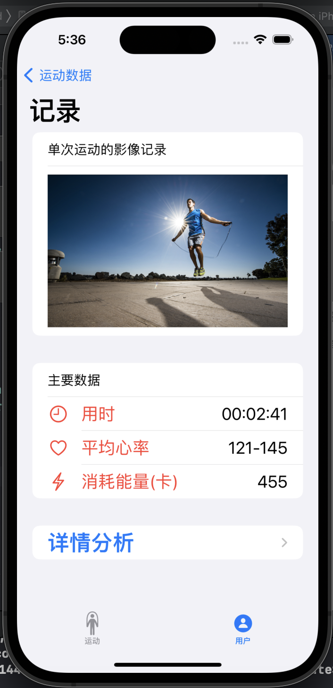
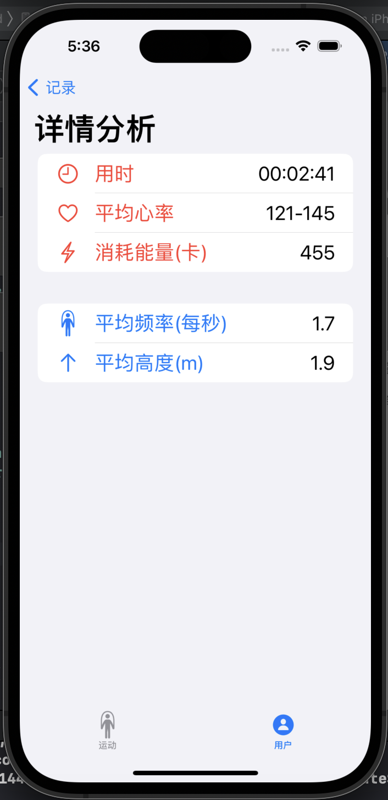

## 运动
### 运动主界面
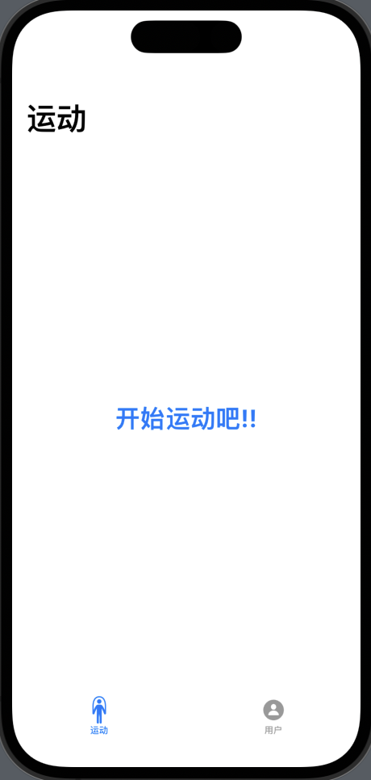
### 运动记录
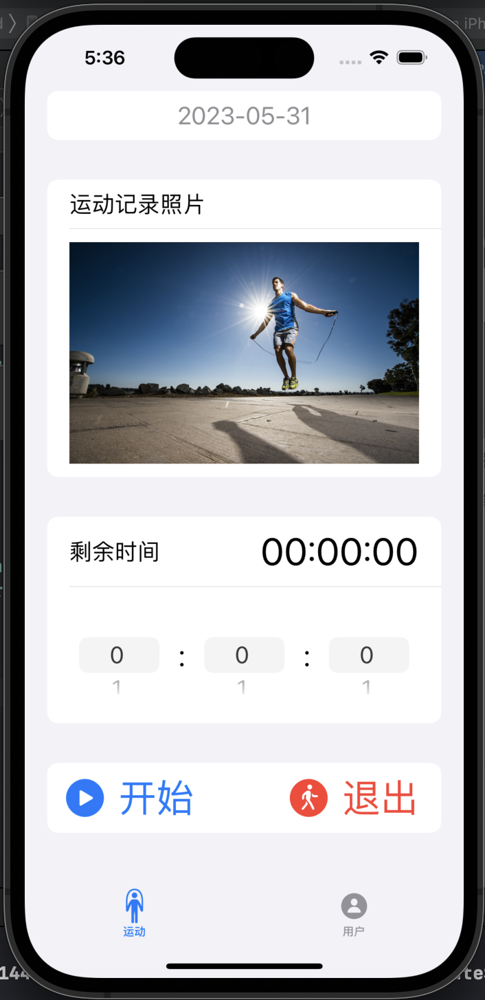
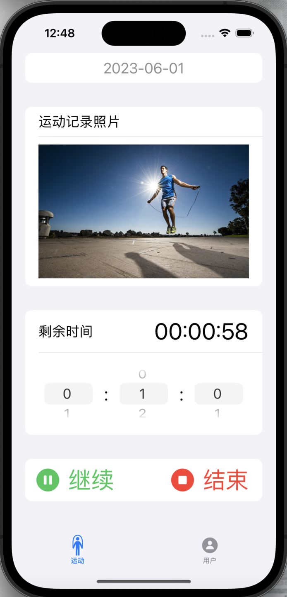
### 退出弹窗
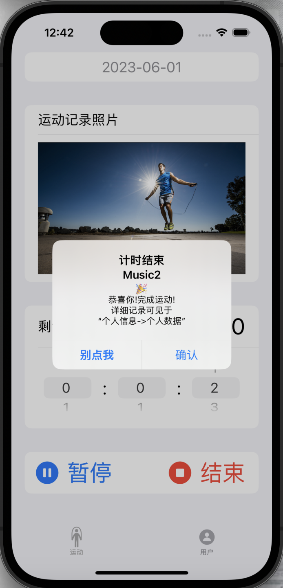
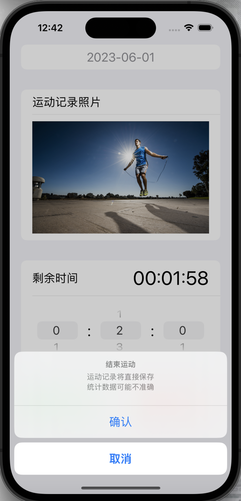
